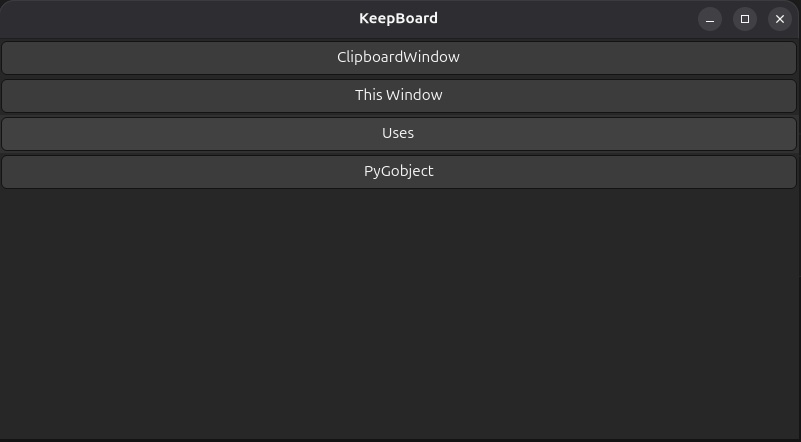

# KeepBoard 📋

A modern clipboard history manager for Linux built with GTK4 and Python. KeepBoard automatically tracks your clipboard history and provides an intuitive interface to access previously copied text.

## Features 

- **Automatic Clipboard Monitoring**: Tracks clipboard changes in real-time
- **Click-to-Copy**: Click any item in the history to copy it back to clipboard
- **Text Truncation**: Long text is intelligently truncated for better UI display
- **Modern GTK4 Interface**: Clean, responsive UI built with the latest GTK4
- **Thread-Safe Operations**: UI updates happen on the main thread for stability
- **Error Handling**: Graceful error handling for clipboard operations
- **No Duplicates**: Automatically prevents duplicate entries in history

## Screenshots 



## Requirements 📋

- Python 3.6+
- GTK4 development libraries
- PyGObject (python3-gi)

## Installation 

### Ubuntu/Debian
```bash
# Install dependencies
sudo apt update
sudo apt install python3-gi python3-gi-cairo gir1.2-gtk-4.0

# Clone the repository
git clone https://github.com/yourusername/KeepBoard.git
cd KeepBoard

# Run the application
python3 app.py
```

### Arch Linux
```bash
# Install dependencies
sudo pacman -S python-gobject gtk4

# Clone and run
git clone https://github.com/yourusername/KeepBoard.git
cd KeepBoard
python3 app.py
```

### Fedora
```bash
# Install dependencies
sudo dnf install python3-gobject gtk4

# Clone and run
git clone https://github.com/yourusername/KeepBoard.git
cd KeepBoard
python3 app.py
```

## Usage 💡

1. **Start the Application**: Run `python3 app.py`
2. **Copy Text**: Copy any text using Ctrl+C or right-click → Copy
3. **View History**: KeepBoard automatically captures and displays clipboard history
4. **Re-copy Items**: Click any item in the history to copy it back to clipboard
5. **Scroll Through History**: Use the scrollable interface to browse through all copied items

## How It Works 🔧

KeepBoard uses GTK4's clipboard monitoring capabilities to detect when new text is copied. The application:

1. **Monitors Clipboard**: Listens for clipboard change events
2. **Captures Text**: Reads the new clipboard content asynchronously
3. **Stores History**: Maintains a list of unique clipboard items
4. **Updates UI**: Adds new items to the scrollable interface
5. **Handles Clicks**: Allows users to re-copy any historical item

## File Structure 📁

```
KeepBoard/
├── app.py              # Main application entry point
├── clipboard.py        # ClipboardWindow class and clipboard logic
├── template.py         # Template/example code
├── README.md          # This file
└── LICENSE            # License file
```

## Technical Details ⚙️

- **Framework**: GTK4 with Python
- **Threading**: Uses GLib.idle_add() for thread-safe UI updates
- **Memory Management**: Efficiently manages clipboard history
- **Error Handling**: Comprehensive error handling for clipboard operations
- **Performance**: Optimized for smooth operation with large clipboard histories

## Contributing 🤝

Contributions are welcome! Please feel free to submit a Pull Request. For major changes, please open an issue first to discuss what you would like to change.

1. Fork the repository
2. Create your feature branch (`git checkout -b feature/AmazingFeature`)
3. Commit your changes (`git commit -m 'Add some AmazingFeature'`)
4. Push to the branch (`git push origin feature/AmazingFeature`)
5. Open a Pull Request

## License 📄

This project is licensed under the MIT License - see the [LICENSE](LICENSE) file for details.

## Acknowledgments 🙏

- Built with [GTK4](https://gtk.org/) and [PyGObject](https://pygobject.readthedocs.io/)
- Inspired by Windows clipboard history functionality
- Thanks to the GTK and Python communities for excellent documentation

## Troubleshooting 🔧

### Common Issues

**"Import gi could not be resolved"**
- Install PyGObject: `sudo apt install python3-gi` (Ubuntu/Debian)

**"No module named 'gi'"**
- Ensure PyGObject is installed for your Python version
- Check that you're using the system Python, not a virtual environment

**Application crashes on startup**
- Verify GTK4 is properly installed
- Check that all dependencies are installed

**Clipboard not being detected**
- Ensure the application has proper permissions
- Try running with `python3 -u app.py` for verbose output

## Roadmap 🗺️

- [ ] Search functionality for clipboard history
- [ ] Keyboard shortcuts for quick access
- [ ] Configurable history size limits
- [ ] Export/import clipboard history
- [ ] Dark/light theme support
- [ ] System tray integration
- [ ] Filter by content type (text, images, etc.)

---

**KeepBoard** - Never lose your clipboard history again! 🎯